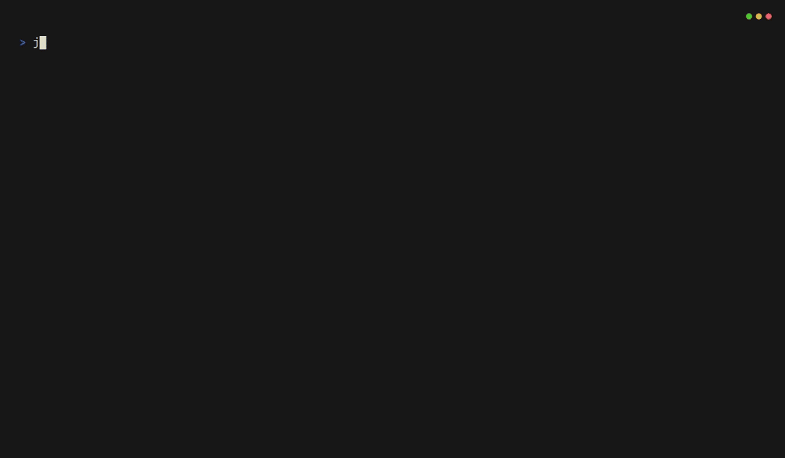

# jira-kanban

A fast, lightweight Jira kanban board for the terminal.




Jira's web interface is resource-heavy and slow — it easily consumes hundreds of megabytes of RAM and still feels sluggish. `jira-kanban` gives you a snappy, keyboard-driven view of your board that stays out of your way and uses a fraction of the resources.

## Install

```
go install github.com/raulvc/jira-kanban@latest
```

## First run

On first launch, `jira-kanban` will prompt for any missing configuration values interactively (with masked input for the API token) and save them automatically:

```
$ jira-kanban
Jira base URL [https://your-company.atlassian.net]:
Email [you@company.com]:
API token:
Board ID [42]:
```

After that, the config file is stored at `~/.config/jira-kanban/config.yml` and you won't be prompted again.

### Configuration file

```yaml
base_url: "https://your-company.atlassian.net"
email: "you@company.com"
api_token: "your-jira-api-token"
board_id: 42
```

> **API token** — Create one at [id.atlassian.com/manage-profile/security/api-tokens](https://id.atlassian.com/manage-profile/security/api-tokens).

### Override the board

You can switch boards without editing the config:

```
jira-kanban 17           # positional board ID
jira-kanban --board 17   # flag form
jira-kanban --debug      # verbose debug logging
```

Logs are always written to a platform-appropriate location (`/var/log/jira-kanban/debug.log` on Linux, `~/Library/Logs/jira-kanban/debug.log` on macOS). Pass `--debug` to increase verbosity and print the log path on startup.

## Keyboard shortcuts

| Key | Action |
|-----|--------|
| `←` / `→` | Move between columns |
| `↑` / `↓` | Move between cards |
| `f` | Filter by assignee |
| `^E` | Filter by epic |
| `s` | Toggle current-sprint filter (scrum boards only; hidden on boards without sprint support) |
| `h` | Toggle hiding empty columns (persisted to config) |
| `/` | Search board (fuzzy, local) — press `Tab` for global JQL search |
| `enter` | View issue details |
| `e` | Edit issue (summary, description, labels, and epic) |
| `^E` | Edit description in `$EDITOR` (from detail view) |
| `t` | Transition issue (with search filter) |
| `o` | Open issue in browser |
| `y` | Copy issue key to clipboard |
| `Ctrl+Y` | Copy issue URL to clipboard |
| `a` | Assign issue (from board or detail view) |
| `c` | Create issue (from board) / Create subtask (from detail view) |
| `C` | Clone issue (copies description, labels, and epic) |
| `H` | Recent activity history |
| `+` | Cycle theme |
| `r` | Refresh board |
| `q` | Quit |

## How it works

- **Cold start** — fetches all visible issues from the board and builds a local cache.
- **Warm start** — returns cached data instantly, then syncs changes in the background.
- **Incremental sync** — only fetches issues that changed since the last sync, instead of re-downloading the entire board.
- **Optimistic transitions** — moving a card updates the UI immediately, then persists to Jira in the background.
- **Assignee management** — assign or unassign issues directly from the board or detail view. The current user is highlighted with a ★ marker.
- **Create issues & subtasks** — create new issues from the board view, and subtasks from the detail modal. Rich text descriptions with URL linking and code blocks are supported. Tab-navigable OK/Cancel buttons.
- **Clone issues** — press `C` to clone the selected issue. Pre-fills the description, labels, and epic from the source; you only need to write a new summary.
- **Edit issues** — press `e` from the detail view to edit an issue's summary, description, labels, and epic. Subtask parent and issue type are shown as locked (non-editable). Press `Ctrl+E` to edit the description in your `$EDITOR` (e.g. nvim, vim).
- **Rich text descriptions** — issue descriptions render with headings, bold, italic, strikethrough, inline code, code blocks, lists, blockquotes, rules, and Jira user mentions, each with distinct colors per theme.
- **Syntax highlighting** — code blocks in descriptions are syntax-highlighted using [chroma](https://github.com/alecthomas/chroma), supporting 200+ languages.
- **Search** — press `/` to fuzzy search across all visible board cards (key, summary, status, assignee, description, labels). Results show a preview pane with matched characters highlighted and the selected card highlighted on the board. Press `Tab` to switch to global JQL search against the entire Jira instance.
- **Subtask navigation** — view and select subtasks inside the detail modal; press Enter to open a nested detail view for any subtask.
- **Copy issue key** — press `y` to copy the selected issue's key (e.g. `PROJ-123`) to the system clipboard.
- **Copy issue URL** — press `Ctrl+Y` to copy the full Jira URL (e.g. `https://yourorg.atlassian.net/browse/PROJ-123`) to the clipboard for easy sharing.
- **Recent activity history** — press `H` to see your recently updated issues with changelog summaries (e.g. "status: To Do → In Progress · 2h ago").
- **Hide empty columns** — press `h` to toggle hiding columns with no issues. The preference is saved to config and restored on next launch.

### Themes

Four built-in color themes are available and can be cycled with `+`:

- **Kanagawa Dark** (default)
- **Kanagawa Light**
- **Darcula**
- **Darcula Light**

The selected theme is saved to `~/.config/jira-kanban/config.yml` and restored on next launch.

```yaml
theme: "Kanagawa Light"
```

Cache is stored at `$XDG_CACHE_HOME/jira-kanban/<board-id>.json`.

## License

BSD-2-Clause